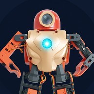

# RoboHero

<!-- robohero-version: 2.1.27 -->
**Version: 2.1.27**

  

RoboHero is a 17-servo humanoid robot platform featuring ESP8266 FreeRTOS firmware, host CLI tooling, an AI-powered real-time desktop teleoperation suite, a Three.js 3D web dashboard and calibrator, an Android companion application, and Home Assistant smart home integration.

I purchased this TTRobotix toy in 2017 and gave it to my wife's nephew. It became mis-calibrated a year later probably out of mistakes in operating it. The robot sat idle in a drawer for years until I brought it back home in 2024 to attempt to fix it. Even though the robot is 10 years old, I've decided to revive it with modern software to give it new life. My daughter enjoys this revived robot a lot and what it can now do!

---

## Documentation Index

### Firmware & Embedded
* [firmware/README.md](firmware/README.md): ESP8266 FreeRTOS firmware architecture, toolchain requirements, build, flash, and serial monitor instructions.

### Applications & Integrations
* **Desktop Teleoperation (`app/teleop`)**
  * [app/teleop/doc/README.md](app/teleop/doc/README.md): Real-time AI pose-tracking desktop application, geometric mapping pipeline, and MQTT teleoperation overview.
  * [app/teleop/doc/Compile-on-Windows.md](app/teleop/doc/Compile-on-Windows.md): Windows MSVC and CMake compilation guide with pre-built dependency setup.
* **Motion & Gait Studio (`app/motion`)**
  * [app/motion/doc/README.md](app/motion/doc/README.md): Standalone Qt/OpenGL biped gait generator, multi-track keyframe choreographer, dual 3D URDF visualizer, and MQTT robot execution studio.
  * [app/motion/doc/Compile-on-Windows.md](app/motion/doc/Compile-on-Windows.md): Windows MSVC and CMake compilation guide with prebuilt Qt dependencies.
* **Home Assistant**
  * [home_assistant/README.md](home_assistant/README.md): Home Assistant MQTT auto-discovery, entity mappings, action triggers, and Lovelace dashboard setup.

### Robot Model & Kinematics
* [doc/Model.md](doc/Model.md): Canonical URDF kinematic tree, `model/calibration.json` single source of truth, and subproject build dependency guidelines.

### Communication Protocol
* [doc/Protocol.md](doc/Protocol.md): Serial UART and MQTT network packet protocol specifications, TLV command opcodes, and servo payload structures.

### Calibration Guides & Datasets
* [doc/joint_calibration_and_measurement_guide.md](doc/joint_calibration_and_measurement_guide.md): Differential angular measurement methodology, scaling math, and calibration workflow.
* [doc/web_model_calibration_guide.md](doc/web_model_calibration_guide.md): Interactive 3D Web Calibrator user guide and real-time visual alignment workflow.
* [doc/joint_calibration_results.md](doc/joint_calibration_results.md): Calibrated joint scale factors (`rad_per_pwm`), zero offsets, angular bounds, and physical limit descriptions.
* [doc/calibrated_servo_trim_20260902.md](doc/calibrated_servo_trim_20260902.md): Canonical servo trim values recorded during the 2026-09-02 calibration session.
* [doc/joint_calibration_20260902.md](doc/joint_calibration_20260902.md): Raw physical measurement log and step-response verification data.
