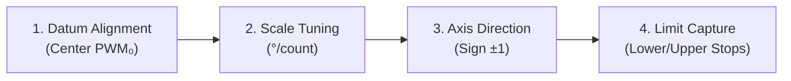

# Web Studio Interactive Model Calibration & URDF Tuning Guide

This guide describes how to use the **Interactive Model Calibrator** in the RoboHero 3D Web Studio (`app/web`) to visually tune joint kinematics, verify physical parity between the robot and its 3D digital twin, capture mechanical stops, and export updated parameters to the source code.

---

## 1. Overview & Purpose

While CAD models and kinematic trees assume nominal servo geometries (e.g. $180^\circ$ or $270^\circ$ total span), physical robots exhibit real-world variances:
- **Servo Horn Spline Teeth**: Discrepancies between CAD zero and actual spline tooth engagement.
- **Servo Resolution Differences**: Variations in potentiometer gear ratios (e.g. $1.0^\circ/\text{count}$ on leg servos vs. $\sim 1.33^\circ/\text{count}$ on arm servos).
- **Physical Mechanical Stops**: Wire routing, brackets, and limb collision boundaries.

The **Model Calibrator** allows you to move the robot live, observe the physical joint, and interactively adjust the 3D model's **center offset**, **angular scaling**, **rotation sign**, and **travel limits** in real time until the 3D model visually matches physical reality.

---

## 2. Quick Start & Prerequisites

### 1. Start the Web Studio
From the workspace root:
```bash
cd app/web
npm run dev
```
Open your browser to `http://localhost:5173`.

### 2. Connect Live Hardware (Optional but Recommended)
- Click the **"Connect MQTT"** button in the top navigation bar.
- Configure your WebSocket broker URL (e.g. `ws://192.168.1.50:9001` or `/mqtt`) and Robot ID (`TTR-ee40`).
- Ensure **"Sync to Robot"** is enabled in the sidebar so slider movements immediately position the physical servos.

---

## 3. Navigating to the Model Calibrator

1. In the left sidebar, click the **"Model Calibrator"** tab (located next to "Pose Studio"):
   
   ```text
   +-----------------------+-----------------------+
   |      Pose Studio      |  [Model Calibrator]   |  <-- Click here
   +-----------------------+-----------------------+
   ```

2. The sidebar displays 17 joint cards grouped by body segment:
   - **Head & Neck**: Channel 16 (GPIO 12)
   - **Left Arm**: Channels 05, 06, 07
   - **Right Arm**: Channels 10, 09, 08
   - **Left Leg**: Channels 04, 03, 02, 01, 00
   - **Right Leg**: Channels 11, 12, 13, 14, 15

3. Use the **search bar** at the top to filter joints quickly (e.g. type `"shoulder"`, `"elbow"`, or `"CH 05"`).

---

## 4. Step-by-Step Joint Calibration Protocol

For each joint you wish to calibrate, follow this 4-step sequence:



> [!TIP]
> **Unconstrained Angles (Ignore Limits)**:
> In standard URDF viewers, revolute joints clamp rotations strictly between `joint.limit.lower` and `joint.limit.upper`.
> When calibrating scaling or finding mechanical limits, keep the **"Unconstrained Angles (Ignore Limits)"** checkbox (at the top of the Model Calibrator panel) **checked**. This allows the 3D model to rotate freely without being clamped by previous/nominal URDF limits so you can see the true angular rotation effect of the scale slider. Uncheck it whenever you want to test the newly captured limits.

### Step 1: Align Zero Center ($PWM_0$)
1. Move the joint slider so the physical limb sits at its exact geometric zero datum (e.g. arm hanging straight down, leg straight, foot orthogonal to shin).
2. Look at the current PWM value on the slider badge.
3. Click the **`Current -> Center`** button in the tuning grid.
4. The 3D model instantly sets this pulse position as $0.0^\circ$ ($0.0000\text{ rad}$).

> [!NOTE]
> **Shoulder Roll Zero Convention**:
> In the humanoid URDF model, angle $0.0^\circ$ ($0.0000\text{ rad}$) is defined as the upright standing pose where the arms hang straight **down** beside the ribs.
> On RoboHero, the electrical servo midpoint (~163) corresponds to the horizontal T-pose ($+90^\circ$). To hang the arms down at standing zero, the physical servos rotate $90^\circ$ to **PWM 243** (Left Shoulder Roll, Ch 6) and **PWM 75** (Right Shoulder Roll, Ch 9). Therefore, the geometric center datum ($PWM_0$) where angle $= 0.0^\circ$ is **243** for Ch 6 and **75** for Ch 9.

### Step 2: Tune Angular Scaling Factor ($^\circ/\text{count}$)
1. Move the joint slider to a known reference angle (e.g. raise the arm horizontally to $90^\circ$ or kick forward).
2. Measure the physical angle on the real robot using a protractor.
3. Observe the 3D model in the viewport:
   - If the 3D model rotated **less** than reality: **Increase** the **Scale (°/count)**.
   - If the 3D model rotated **more** than reality: **Decrease** the **Scale (°/count)**.
4. **Interactive Adjustment Options**:
   - **Scale Slider**: Drag the slider smoothly between `0.300°` and `2.500°` and watch the 3D mesh rotate continuously in real time to match the real robot's posture.
   - **Numeric Input**: Type an exact value (e.g. `1.150` or `1.3333`) into the number box.
   - **Quick Preset Pills**: Click a pill to instantly snap to standard kinematics:
     - **`1.0° (π/180)`**: Standard leg joints and head yaw ($1.0000^\circ/\text{count}$).
     - **`1.33° (π/135)`**: Standard arm pitch/roll joints ($1.3333^\circ/\text{count}$).
     - **`0.67° (π/270)`**: Default CAD nominal ($0.6667^\circ/\text{count}$).
5. As you adjust the slider or input, the 3D mesh and angle readouts update dynamically.

### Step 3: Verify Rotation Direction (Axis Sign)
1. Slide the PWM slider to the right (increasing PWM).
2. Check if the physical limb and the 3D model rotate in the same direction.
3. If the 3D model moves in reverse:
   - Click the **`Axis Direction`** button to toggle between **`+1 (Normal)`** and **`-1 (Inverted)`**.

### Step 4: Capture Hard Mechanical Limits
1. Slowly step the joint slider (using the `−` and `+` step buttons) towards its physical lower boundary until just before it binds or makes contact with the chassis.
2. Click **`Set Current`** under **Lower Limit (Min)**.
3. Move the joint slider towards its physical upper boundary.
4. Click **`Set Current`** under **Upper Limit (Max)**.
5. Both the degree value and radian limit (`<limit lower="..." upper="..."/>`) are updated instantly.

---

## 5. Extracting Calibrated Parameters

Once you have tuned your joints:

1. Click the prominent **`Extract Parameters`** button at the top of the calibrator panel:

   ```text
   +-----------------------------------------------+
   | [Search joint...]                             |
   | [ 📥 Extract Parameters ]  [Reset All Defaults] |
   +-----------------------------------------------+
   ```

2. The **Extract Calibrated Model Parameters** modal will appear with three tabs:

### Tab 1: URDF XML (`<limit>`)
Generates `<limit lower="..." upper="..." effort="1.2" velocity="3.14"/>` XML tags for all 17 joints:
```xml
<!-- CH 05: Shoulder Pitch (left_shoulder_pitch_joint) -->
<!-- Measured Range: [-180.0°, 90.0°] | Scale: 1.3333°/PWM -->
<joint name="left_shoulder_pitch_joint" ...>
  <limit lower="-3.1416" upper="1.5708" effort="1.2" velocity="3.14"/>
</joint>
```

### Tab 2: RobotModel.js (`CHANNEL_MAP`)
Generates the complete JavaScript dictionary for `CHANNEL_MAP`:
```javascript
export const CHANNEL_MAP = {
  0 : { name: 'left_ankle_roll_joint', group: 'left_leg', label: 'Ankle Roll', center: 160, sign:  1.0, radPerPwm: (Math.PI / 180), lower: -0.4363, upper: 1.3090 },
  ...
};
```

### Tab 3: Calibration JSON
Produces a timestamped machine-readable JSON dataset containing all calibrated parameters.

3. Click **`Copy to Clipboard`** to copy the code, or click **`Download JSON`** to save the file.

---

## 6. How to Apply Extracted Parameters to the Source Code

### 1. Update URDF Model (`urdf/robohero.urdf`)
1. Open [urdf/robohero.urdf](../urdf/robohero.urdf).
2. Copy the XML snippet from **Tab 1 (URDF XML)** in the extract modal.
3. Locate each joint definition by name (e.g. `<joint name="left_shoulder_pitch_joint" ...>`).
4. Replace the existing `<limit lower="..." upper="..."/>` line with the new calibrated values.

### 2. Update Web Viewer Kinematics (`app/web/src/viewer/RobotModel.js`)
1. Open [app/web/src/viewer/RobotModel.js](../app/web/src/viewer/RobotModel.js).
2. Copy the JavaScript snippet from **Tab 2 (RobotModel.js)** in the extract modal.
3. Replace the `export const CHANNEL_MAP = { ... };` block (around lines 15..32).

---

## 7. Validation & Build Verification

After saving the source files, run the automated verification checks:

1. **Validate URDF Kinematic Consistency**:
   ```bash
   python3 scripts/validate_urdf.py
   ```
   *Expected output*: `URDF Validation PASSED` with all 17 hardware channels mapped cleanly.

2. **Validate Web Studio Production Build**:
   ```bash
   cd app/web
   npm run build
   ```
   *Expected output*: Vite builds cleanly (`✓ built in ...`) with zero compilation errors.

---

## 8. Summary of Keyboard & Mouse Controls

| Action | Control |
|---|---|
| **Rotate 3D Viewport** | Left-click + drag |
| **Pan 3D Viewport** | Right-click + drag (or Shift + Left-click + drag) |
| **Zoom Viewport** | Mouse wheel scroll |
| **Step PWM Fine Adjustment** | Click `−` / `+` buttons beside slider |
| **Quick Angle Preset** | Click pill buttons `1.0° (π/180)`, `1.33° (π/135)`, `0.67° (π/270)` |
| **Capture Current Angle as Zero** | Click `Current -> Center` |
| **Capture Mechanical Stop** | Click `Set Current` under Lower or Upper Limit |
| **Reset Joint to Defaults** | Click `↺ Reset Joint to Default` |
